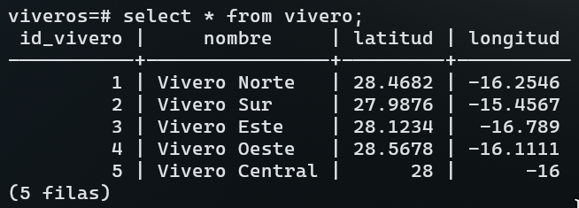
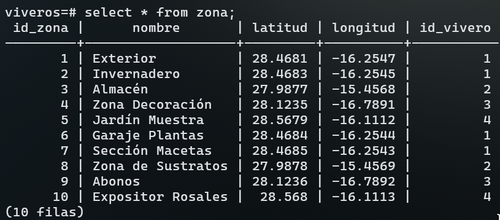
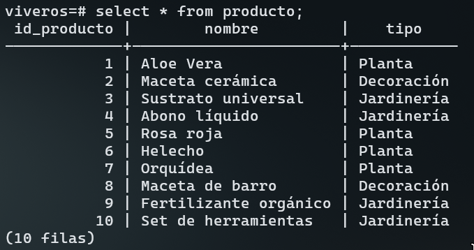
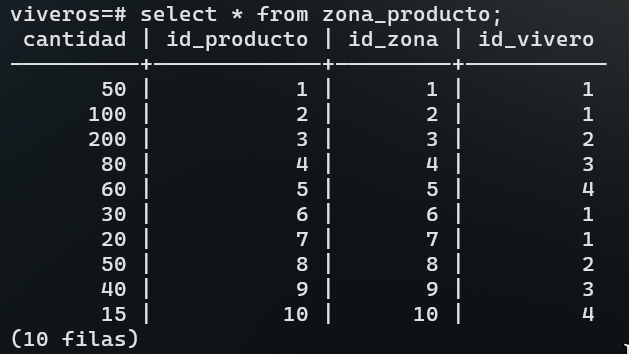
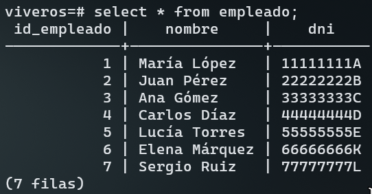
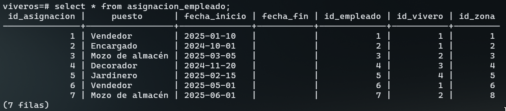
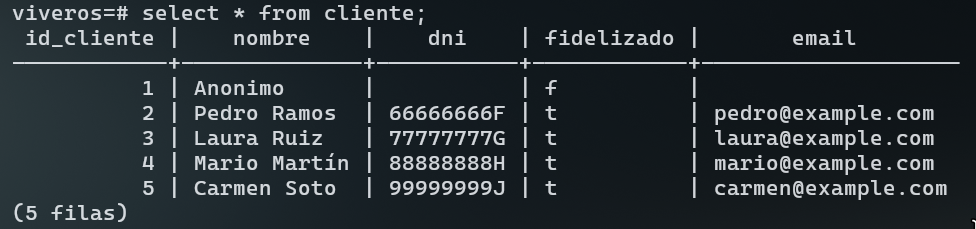
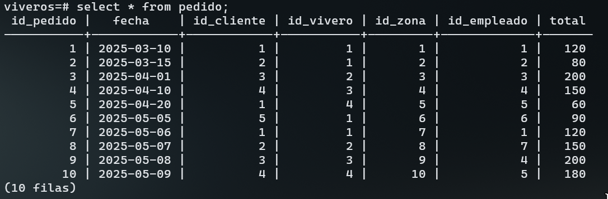
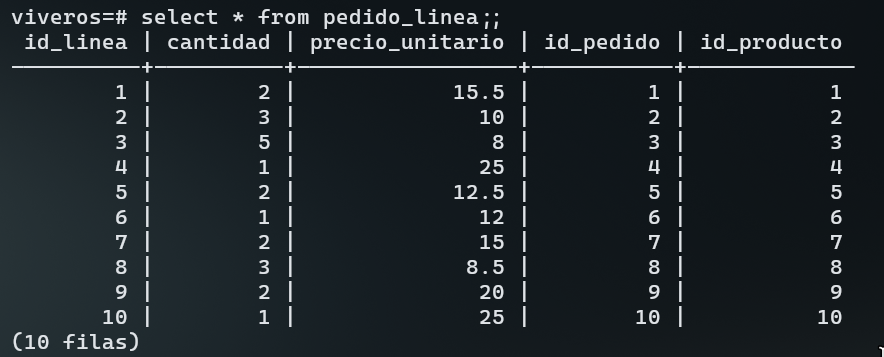
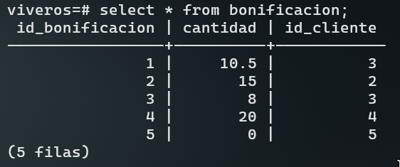

# Estructura de la Base de Datos — Tajinaste S.A.

Este documento muestra las principales tablas del sistema y una vista de sus contenidos mediante imágenes generadas desde las consultas `SELECT * FROM <NOMBRE_TABLA>;`.

---

## Tabla: **vivero**

---

## Tabla: **zona**

---

## Tabla: **producto**

---

## Tabla: **zona_producto**

---

## Tabla: **empleado**

---

## Tabla: **asignacion_empleado**

---

## Tabla: **cliente**

---
## 🧾 Tabla: **pedido**

---

## 🧱 Tabla: **pedido_linea**

---

## 🎁 Tabla: **bonificacion**

---

### 🗑️ Ejemplos de eliminaciones
En este repositorio también se incluyen ejemplos de consultas `DELETE` en el fichero [`deletes.sql`](./deletes.sql), donde se muestra el comportamiento de las eliminaciones en cascada y otras reglas de integridad referencial.
